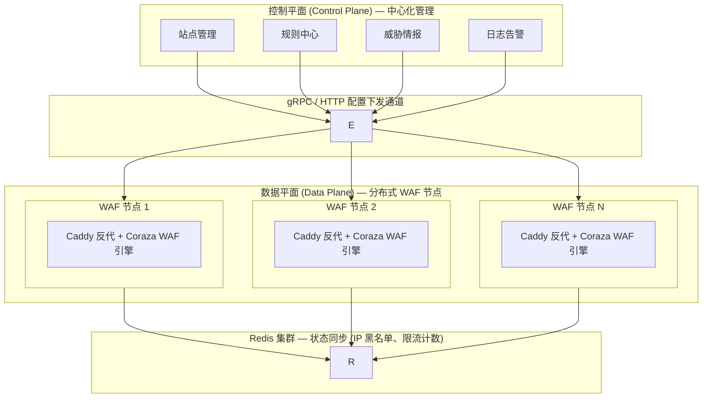
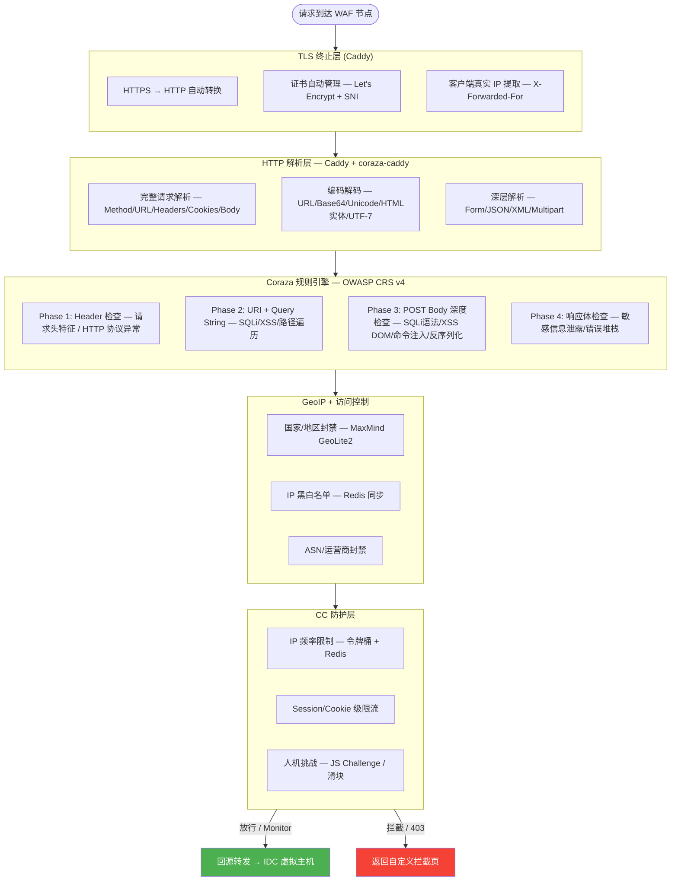
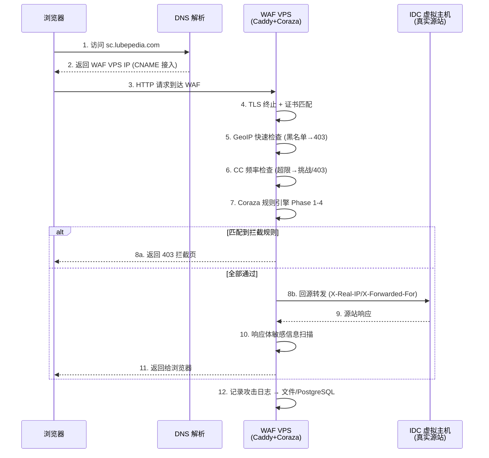
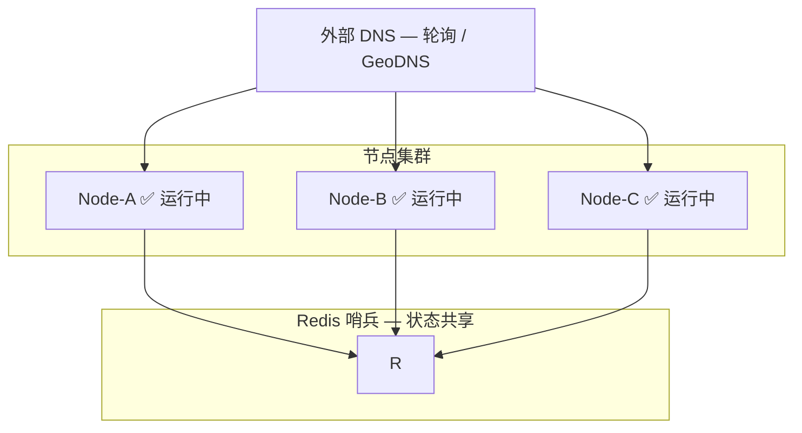

# WAF 系统开发文档

> Web Application Firewall — 面向虚拟主机、跨服务器的自托管 WAF 系统

---

## 目录

- [1. 项目概述](#1-项目概述)
- [2. 系统架构](#2-系统架构)
- [3. 模块详细设计](#3-模块详细设计)
- [4. 技术栈选型](#4-技术栈选型)
- [5. 部署模式](#5-部署模式)
- [6. WAF 自身安全设计](#6-waf-自身安全设计)
- [7. 数据模型](#7-数据模型)
- [8. API 设计](#8-api-设计)
- [9. 开发计划](#9-开发计划)
- [10. 参考资料](#10-参考资料)

---

## 1. 项目概述

### 1.1 项目背景

IDC 虚拟主机用户面临的痛点：
- 只有 80/443 端口，无法自定义端口
- 无服务器 root 权限，无法安装任何软件
- 无法修改防火墙规则
- 容易被 SQL 注入、XSS、CC 攻击

### 1.2 项目目标

构建一套 **自托管、低成本、可扩展** 的 WAF 系统，满足：

| 目标 | 说明 |
|-----|------|
| 虚拟主机防护 | 通过 CNAME/反向代理模式保护无 root 权限的 IDC 虚拟主机 |
| 多站点统一防护 | 一个 WAF 实例保护多个域名/多个虚拟主机 |
| 跨服务器防护 | 分布式节点，控制平面 + 数据平面分离 |
| 生产级稳定 | Fail-Open 设计、资源隔离、高可用 |
| 成本可控 | 基于开源组件，最低一台 VPS 即可起步 |

### 1.3 核心防护能力

- SQL 注入、XSS、RCE、命令注入、文件包含、路径遍历、WebShell
- CC 攻击（频率限制、人机识别、会话级限流）
- 恶意爬虫/Bot 管理
- GeoIP 地理位置封禁
- IP 黑白名单、自定义规则
- 敏感信息泄露防护

---

## 2. 系统架构

### 2.1 总体架构：控制平面 + 数据平面分离



### 2.2 数据平面单节点内部架构



### 2.3 请求处理完整流程



---

## 3. 模块详细设计

### 3.1 模块清单

| 模块 | 位置 | 技术 | 优先级 |
|-----|------|------|--------|
|│ 反向代理层 | 数据平面 | Caddy + coraza-caddy v2 | P0 |
| 规则检测引擎 | 数据平面 | Coraza (Go) + OWASP CRS v4 | P0 |
|│ HTTP 解析器 | 数据平面 | Caddy 原生解析 | P0 |
| 编码解码器 | 数据平面 | Lua 自实现 + C 扩展 | P0 |
| CC 防护模块 | 数据平面 | Lua + Redis | P0 |
| GeoIP 模块 | 数据平面 | MaxMind GeoLite2 + nginx geoip2 | P0 |
| 黑白名单 | 数据平面 | Lua + Redis | P0 |
|│ 攻击日志 | 数据平面 | coraza-caddy 审计日志 + 文件/PostgreSQL | P0 |
| 配置热加载 | 数据平面 | Lua shared_dict + 定时拉取 | P1 |
| Web 管理界面 | 控制平面 | Vue 3 + Go API | P1 |
| 站点/规则管理 | 控制平面 | Go + PostgreSQL | P1 |
| 威胁情报同步 | 控制平面 | Go + HTTP | P2 |
| Bot 检测 | 数据平面 | Lua + JS 挑战 | P2 |
| 分布式节点 | 跨平面 | gRPC + Redis Pub/Sub | P2 |

### 3.2 核心模块接口设计

#### 3.2.1 规则引擎接口

```go
// Coraza 集成接口
type RuleEngine interface {
    // 加载规则集（支持热加载，无需重启）
    LoadRules(siteID string, rulePaths []string) error
    
    // 执行检测，返回动作（Allow/Block/Monitor）
    Evaluate(req *http.Request) (*EvaluationResult, error)
    
    // 获取当前加载的规则版本
    GetRuleVersion() string
}

type EvaluationResult struct {
    Action      ActionType   // Allow, Block, Monitor
    MatchedRules []MatchedRule
    Score       int          // 规则得分（可选阈值模式）
    Latency     time.Duration
}

type MatchedRule struct {
    RuleID      string
    RuleFile    string
    Description string
    Severity    Severity    // 1-5
    Payload     string      // 触发规则的 payload
}
```

#### 3.2.2 CC 防护接口

```lua
-- OpenResty Lua 层 CC 防护
local cc_protect = {
    -- 检查 IP 频率（令牌桶）
    check_rate = function(self, client_ip, zone, limit, window)
        -- 利用 Redis INCR + EXPIRE 实现
        -- 超限返回 false
    end,
    
    -- 会话级检查（基于 Cookie/Session）
    check_session = function(self, session_id, limit, window) end,
    
    -- 人机挑战（JS Challenge）
    issue_challenge = function(self, client_ip, session_id)
        -- 返回一段 JS，客户端执行后生成 token
        -- token 存入 Redis 标记为"已验证"
    end,
    
    -- 检查人机挑战结果
    verify_challenge = function(self, client_ip, token) end,
}
```

#### 3.2.3 回源接口

```nginx
# OpenResty 回源配置（每站点可自定义）
location / {
    # 回源到 IDC 虚拟主机
    proxy_pass http://$upstream_idc;
    
    # 真实 IP 传递
    proxy_set_header Host              $host;
    proxy_set_header X-Real-IP        $remote_addr;
    proxy_set_header X-Forwarded-For  $proxy_add_x_forwarded_for;
    proxy_set_header X-Forwarded-Proto $scheme;
    
    # 超时（IDC 虚拟主机可能响应慢）
    proxy_connect_timeout 10s;
    proxy_read_timeout    30s;
    proxy_send_timeout    10s;
    
    # 失败重试
    proxy_next_upstream error timeout http_500 http_502 http_503;
    
    # 攻击拦截时不记录访问日志（减少 I/O）
    access_log off;
}
```

### 3.3 规则体系设计

#### 3.3.1 规则优先级

```
优先级  类型              来源                示例
────────────────────────────────────────────────────────────────
1      GeoIP 封禁         自定义              封禁 KP/IR
2      IP 黑名单          自定义/威胁情报       已知恶意 IP
3      CC 频率限制        自定义              单 IP 100次/分钟
4      精确 URL 规则      自定义              只保护 /admin.php
5      OWASP CRS 规则集   内置                SQLi/XSS/RCE 通用检测
6      站点专属规则       自定义              WordPress 特定漏洞补丁
7      白名单规则         自定义              搜索引擎放行
```

#### 3.3.2 规则语法

```nginx
# 使用 ModSecurity SecLang（Coraza 兼容）

# === 全局规则 ===
SecRuleEngine On                   # 引擎开关
SecStatusEngine Off                # 性能状态监控（生产关闭）

# === SQL 注入检测示例 ===
SecRule ARGS "@rx (?i)(union\s+select|or\s+1=1|sleep\s*\()" \
    "id:100001,\
    phase:2,\
    block,\
    t:none,\
    msg:'SQL Injection Detected',\
    severity:3,\
    log,\
    tag:sql_injection"

# === XSS 检测示例 ===
SecRule ARGS|ARGS_NAMES|REQUEST_HEADERS "@rx (?i)(<script|javascript:|on\w+\s*=)" \
    "id:100002,\
    phase:2,\
    block,\
    t:htmlEntityDecode,t:jsDecode,t:lowercase,\
    msg:'XSS Attack Detected',\
    severity:3"

# === 自定义 Lua 规则 ===
SecRule REQUEST_URI "@streq /custom-check" \
    "id:900001,\
    phase:1,\
    allow,\
    log,\
    msg:'Custom Lua Check Passed'" \
    chain
    SecAction "setvar:'tx.custom_check_result=%{lua:custom_check(ngx.var.request)}'"
```

---

## 4. 技术栈选型

### 4.1 核心组件

| 组件 | 版本 | 用途 | 选型理由 |
|-----|------|------|---------|
| **Caddy** | 2.11+ | 反向代理 + TLS + WAF 承载层 | 自动 HTTPS、配置简洁、coraza-caddy 官方支持 |
| **coraza-caddy** | v2 最新 | Coraza WAF 引擎嵌入 Caddy | OWASP 官方维护，与 Coraza 同步更新 |
| **Coraza** | v0.9+ | WAF 检测引擎 (Go) | OWASP 官方项目，ModSecurity 兼容，高性能 |
| **OWASP CRS** | v4.0+ | 通用攻击规则集 | 社区维护，2000+ 规则，覆盖 OWASP Top 10 |
| **MaxMind GeoLite2** | 最新 | IP 地理定位 | 业界标杆，本地 mmdb 零延迟，Nginx 原生支持 |
| **Redis** | 7.0+ | 状态共享 + 限流计数 | 高性能，Lua 脚本支持，Pub/Sub |
| **PostgreSQL** | 15+ | 规则存储 + 攻击日志 | 可靠，JSON 支持，全文搜索 |
| **Go** | 1.22+ | 控制平面 / API 服务 | 与 Coraza 同语言，高并发 |
| **Vue 3** | 3.4+ | Web 管理界面 | 现代化 UI，生态好 |
| **Docker** | 24+ | 容器化部署 | 标准化，便于分发和隔离 |

### 4.2 Caddy 关键能力

```
Caddy (核心)
├── 反向代理 (reverse_proxy)
├── 自动 HTTPS (Let's Encrypt + ZeroSSL)
├── 请求头操作 (header_up/header_down)
├── 路由匹配 (route / handle / path)
└── 响应压缩 (encode gzip)

第三方插件
└── coraza-caddy/v2           ← Coraza WAF 引擎嵌入
    load_owasp_crs             ← 内置 OWASP CRS
    order coraza_waf first     ← 排在其他 handler 前执行
    custom_redirect            ← 拦截时返回自定义页面
```

### 4.3 语言分工

```
Go     → Coraza WAF 引擎（已嵌入 coraza-caddy）
        控制平面、规则管理 API、配置下发服务
Caddyfile → 数据平面配置（站点路由、WAF 规则引用）
SecLang  → Coraza 规则（ModSecurity 兼容语法）
SQL    → PostgreSQL 规则查询、攻击日志查询
Vue/JS → 管理界面
Shell  → 部署脚本、运维自动化
```

---

## 5. 部署模式

### 5.1 模式一：CNAME 接入（虚拟主机场景）— 主方案

```
客户端
  │
  ▼ DNS CNAME 解析
┌────────────┐
│ Caddy + Coraza │  ← 你的 VPS
│ (反向代理 + WAF)│
└─────┬──────┘
      │ proxy_pass
      ▼
┌────────────┐
│ IDC 虚拟主机 │  ← 只开放 80/443，你无权修改
│ (123.45.67.89)
└────────────┘
```

**DNS 配置**：
```
之前：
  A    @    123.45.67.89
  A    www  123.45.67.89

之后：
  A    @    98.76.54.32    ← 你的 WAF VPS IP
  A    www  98.76.54.32
```

**优点**：IDC 零感知、零修改
**缺点**：攻击者可能查到真实 IP（通过历史 DNS）

### 5.2 模式二：同服务器反代（自有服务器场景）

```
客户端 → Caddy(Coraza WAF) → 本机后端 (:8080, :3000, ...)
```

### 5.3 模式三：分布式多节点（生产扩容）

```
客户端 → 最近的 WAF Node → 回源 IDC/自有服务器
              │
         Redis 集群（IP 黑名单同步、限流状态共享）
              │
         控制平面（统一管理所有节点）
```

### 5.4 虚拟主机真实 IP 隐藏方案

| 方案 | 可行性 | 效果 | 说明 |
|-----|--------|------|------|
| CNAME + .htaccess IP 白名单 | ✅ 高 | 好 | Apache 虚拟主机几乎都支持 |
| CNAME + Cloudflare Pro 橙色云 | ✅ 高 | 最好 | Cloudflare IP 段发布，可以配置 IP 白名单 |
| CNAME 接受现实 | ✅ 必须 | 80% | 大部分攻击者不会查历史 DNS |
| DNS 劫持（IDC 不支持自定义 DNS） | ❌ 不行 | — | IDC 虚拟主机 DNS 由他们控制 |

**.htaccess 白名单配置示例（Apache 虚拟主机）**：
```apache
# 只允许你的 WAF VPS IP 访问
Order Deny,Allow
Deny from all
Allow from 98.76.54.32
Allow from 127.0.0.1

# 保护敏感后台
<FilesMatch "^(wp-admin|admin|login)">
    Order Allow,Deny
    Allow from 98.76.54.32
    Allow from 你的公网IP
    Deny from all
</FilesMatch>
```

---

## 6. WAF 自身安全设计

### 6.1 Fail-Open（故障保护）— 第一优先级

```
┌─────────────────────────────────────────────────────────────┐
│                    WAF 运行状态监测                           │
│                                                             │
│  │ 监测项                    │ 阈值              │ 动作      │
│  ├─────────────────────────────────────────────────────────┤
│  │ Caddy 进程存活           │ 每秒 health check │ 无动作     │
│  │ coraza-caddy 插件存活    │ 心跳 1s           │ 降级/绕过  │
│  │ 内存使用率                │ > 85%            │ 绕过检测   │
│  │ CPU 使用率                │ > 90% 持续 30s   │ 绕过检测   │
│  │ 请求处理超时              │ > 500ms 检测耗时  │ 放行请求   │
│  │ 规则解析错误              │ 加载失败          │ 降级模式   │
│  │ Redis 不可用              │ 连接失败          │ 跳过 CC 检查│
│  │ PostgreSQL 不可用         │ 连接失败          │ 跳过日志   │
│                                                             │
│  降级定义：流量直接放行，不做检测，但仍记录基础访问           │
└─────────────────────────────────────────────────────────────┘
```

### 6.2 资源隔离

```yaml
# Docker Compose 资源限制
services:
│  waf-caddy:
│    image: custom/caddy-coraza:latest
    deploy:
      resources:
        limits:
          cpus: '2.0'
          memory: 512M
        reservations:
          cpus: '0.5'
          memory: 128M
    ulimits:
      nofile:
        soft: 65536
        hard: 65536
    restart: always  # OOM 自动重启

  control-plane:
    image: custom/waf-control:latest
    deploy:
      resources:
        limits:
          cpus: '1.0'
          memory: 256M
    restart: on-failure
```

### 6.3 管理平面安全

| 威胁 | 防护 |
|-----|------|
| 管理 API 被扫 | mTLS 双向认证 + 内网/IP 白名单访问 |
| 暴力破解 | 多因素认证 + 登录失败锁定 |
| 规则被篡改 | 热加载 + 版本回滚 + 审计日志 |
| WAF 自身被绕过 | 管理后台只监听 127.0.0.1，通过 SSH 隧道访问 |

### 6.4 规则沙箱化

```
┌──────────────────────────────────────────────────────────┐
│                    规则执行沙箱                             │
│                                                          │
│  │ Coraza 作为独立插件，检测崩溃不影响 Caddy 主进程          │
│  • 单条规则正则匹配超时 < 10ms                             │
│  • 总检测超时 < 50ms（超过则放行 + 记录告警）                │
│  • 规则上线前自动测试（跑 BlazeHTTP/OWASP CRS 单元测试）     │
│  • 新规则先 Monitor 模式跑 7 天，确认无误后切 Block          │
│                                                          │
│  正则死循环防护：                                         │
│  • 自定义 Lua 正则执行器 + 超时控制                        │
│  • 禁止嵌套量词 (a+)+、(a|a)* 等危险模式                   │
└──────────────────────────────────────────────────────────┘
```

### 6.5 节点高可用



**故障切换**：节点 1s 心跳上报 → 控制平面 3s 无响应则标记离线 → DNS 自动摘除 → 客户端超时重试下一个节点。

---

## 7. 数据模型

### 7.1 站点表 (sites)

```sql
CREATE TABLE sites (
    id              BIGSERIAL PRIMARY KEY,
    name            VARCHAR(255) NOT NULL,          -- 站点名称
    domain          VARCHAR(512) NOT NULL,          -- 主域名 (a.com)
    aliases         TEXT[],                          -- 别名 (www.a.com, *.a.com)
    origin_ip       INET NOT NULL,                   -- 回源 IP (IDC 虚拟主机)
    origin_port     INT NOT NULL DEFAULT 80,         -- 回源端口
    origin_protocol VARCHAR(10) NOT NULL DEFAULT 'http', -- http / https
    
    -- WAF 配置
    waf_enabled     BOOLEAN DEFAULT TRUE,
    protection_mode VARCHAR(20) DEFAULT 'block',      -- block / monitor / bypass
    ruleset_id      BIGINT REFERENCES rulesets(id),  -- 关联的规则集
    
    -- CC 配置
    cc_enabled      BOOLEAN DEFAULT TRUE,
    cc_rate_limit   INT DEFAULT 100,                 -- 单 IP 请求数
    cc_window       INT DEFAULT 60,                  -- 时间窗口(秒)
    
    -- GeoIP 配置
    geoip_enabled   BOOLEAN DEFAULT FALSE,
    geoip_block_countries TEXT[],                    -- 封禁国家代码
    
    -- 状态
    status          VARCHAR(20) DEFAULT 'active',
    created_at      TIMESTAMP DEFAULT NOW(),
    updated_at      TIMESTAMP DEFAULT NOW()
);
CREATE INDEX idx_sites_domain ON sites USING gin(aliases);
```

### 7.2 规则集表 (rulesets)

```sql
CREATE TABLE rulesets (
    id          BIGSERIAL PRIMARY KEY,
    name        VARCHAR(255) NOT NULL,
    description TEXT,
    type        VARCHAR(20) DEFAULT 'custom',        -- owasp_crs / custom / site_specific
    version     VARCHAR(50),
    content     TEXT NOT NULL,                       -- SecLang 规则内容
    is_active   BOOLEAN DEFAULT TRUE,
    created_at  TIMESTAMP DEFAULT NOW()
);
```

### 7.3 攻击日志表 (attack_logs)

```sql
CREATE TABLE attack_logs (
    id              BIGSERIAL PRIMARY KEY,
    site_id         BIGINT REFERENCES sites(id),
    
    -- 请求信息
    client_ip       INET NOT NULL,
    client_geoip    JSONB,                           -- {country, region, city}
    method          VARCHAR(10),
    url             TEXT,
    query_string    TEXT,
    user_agent      TEXT,
    host            VARCHAR(255),
    referer         TEXT,
    request_body    TEXT,
    
    -- WAF 检测结果
    matched_rule_id VARCHAR(50),
    matched_rule_desc TEXT,
    attack_type     VARCHAR(100),                    -- sql_injection / xss / rce ...
    severity        INT,                             -- 1-5
    action          VARCHAR(20),                     -- block / monitor
    payload         TEXT,                            -- 触发规则的 payload
    
    -- 性能
    detection_latency INTEGER,                       -- ms
    
    created_at      TIMESTAMP DEFAULT NOW()
);
CREATE INDEX idx_attack_logs_site ON attack_logs(site_id);
CREATE INDEX idx_attack_logs_time ON attack_logs(created_at);
CREATE INDEX idx_attack_logs_type ON attack_logs(attack_type);
```

### 7.4 IP 黑白名单 (Redis)

```
# Redis Key 设计
ip_blacklist          Set    → {1.2.3.4, 5.6.7.8, ...}
ip_whitelist          Set    → {搜索引擎 IP, 内部运维 IP, ...}
site:{id}:rate        String → 计数 (INCR + EXPIRE)
site:{id}:blocked     String → TTL = 封禁时长

# Set 操作示例
SADD ip_blacklist 1.2.3.4
SISMEMBER ip_blacklist 1.2.3.4  → 返回 1/0

# 频率限制示例
INCR site:1:rate:1.2.3.4        → 原子自增
EXPIRE site:1:rate:1.2.3.4 60   → 60s 窗口
GET site:1:rate:1.2.3.4         → 检查次数
```

---

## 8. API 设计

### 8.1 控制平面 REST API

```
BASE: /api/v1

# 站点管理
GET    /sites                  → 列表（分页）
POST   /sites                  → 创建站点
GET    /sites/:id              → 详情
PUT    /sites/:id              → 更新
DELETE /sites/:id              → 删除
PUT    /sites/:id/bypass       → 临时绕过 / 恢复防护
PUT    /sites/:id/monitor      → 切到监控模式

# 规则管理
GET    /rulesets               → 规则集列表
POST   /rulesets               → 创建规则集
GET    /rulesets/:id           → 规则集详情（含版本历史）
PUT    /rulesets/:id           → 更新规则集
POST   /rulesets/:id/validate  → 验证规则语法
POST   /rulesets/:id/deploy    → 下发到数据平面

# IP 管理
GET    /ips/blacklist          → 黑名单列表
POST   /ips/blacklist          → 添加
DELETE /ips/blacklist/:ip      → 删除
GET    /ips/whitelist          → 白名单列表

# 日志查询
GET    /logs/attacks           → 攻击日志（分页 + 过滤）
GET    /logs/stats             → 统计（按类型/时间/站点）
GET    /logs/top-attacks       → 高频攻击模式
GET    /logs/top-ips           → 高频攻击 IP

# 节点管理
GET    /nodes                  → 节点列表 + 状态
GET    /nodes/:id/health       → 健康详情
POST   /nodes/:id/drain        → 摘除节点

# 系统
GET    /system/health          → 控制平面健康
GET    /system/version         → 版本
GET    /system/config          → 配置（脱敏）
```

### 8.2 数据平面 gRPC API（节点 → 控制平面）

```protobuf
service NodeService {
    // 心跳上报
    rpc Heartbeat(HeartbeatRequest) returns (HeartbeatResponse);
    
    // 获取配置（站点列表、规则集版本）
    rpc GetConfig(GetConfigRequest) returns (GetConfigResponse);
    
    // 配置变更推送（控制平面主动推）
    rpc StreamConfig(stream ConfigUpdate) returns (stream Acknowledgement);
    
    // 攻击日志批量上报
    rpc SendAttackLogs(stream AttackLog) returns (SendResult);
}
```

---

## 9. 开发计划

### Phase 1：MVP — 单机单站 WAF（2-4 周）

**目标**：跑通核心流程，能保护一个 IDC 虚拟主机

- [ ] Caddy + coraza-caddy 基础部署
- [ ] OWASP CRS v4 规则集集成
- [ ] 反向代理到 IDC 虚拟主机
- [ ] 基础 GeoIP 封禁
- [ ] IP 黑白名单（Redis）
- [ ] 基础 CC 防护（IP 频率限制）
- [ ] 攻击日志本地记录
- [ ] 手动 Bypass 功能（环境变量切换）
- [ ] Docker Compose 一键部署

**交付物**：`docker-compose up` 即可启动的 WAF 容器

### Phase 2：多站点 + 管理（4-6 周）

**目标**：一个节点保护多个虚拟主机，可视化管理

- [ ] Host Header 路由多站点
- [ ] PostgreSQL 存储站点/规则
- [ ] 规则热加载（无需重启）
- [ ] Web 管理界面（站点/规则/IP 管理）
- [ ] 攻击日志查询界面
- [ ] GeoLite2 自动更新脚本
- [ ] Let's Encrypt 自动证书续签

### Phase 3：分布式 + 高可用（6-8 周）

**目标**：跨服务器防护，生产级可靠

- [ ] 控制平面 / 数据平面分离
- [ ] gRPC 配置下发
- [ ] Redis 集群（状态同步）
- [ ] 多节点集群 + 健康检测
- [ ] Fail-Open 故障切换
- [ ] 节点自动发现（Etcd/Consul）
- [ ] Prometheus 监控 + Grafana 面板

### Phase 4：高级特性（持续迭代）

- [ ] 语义分析增强（降低误报）
- [ ] Bot 管理（JS Challenge + 设备指纹）
- [ ] 网页防篡改
- [ ] 敏感信息脱敏（响应体）
- [ ] 威胁情报订阅
- [ ] AI 异常检测（0day 防护）
- [ ] 透明代理旁路模式

---

## 10. 参考资料

### WAF 产品参考
- [阿里云 WAF 3.0](https://help.aliyun.com/waf/web-application-firewall-3-0/)
- [腾讯云 WAF](https://cloud.tencent.com/product/waf)
- [华为云 WAF](https://support.huaweicloud.com/productdesc-waf/waf_01_0094.html)
- [Cloudflare WAF](https://developers.cloudflare.com/waf/)
- [SafeLine WAF](https://github.com/chaitin/SafeLine)

### 开源组件
- [Caddy](https://caddyserver.com/)
- [coraza-caddy 集成指南](https://wafplanet.com/guides/coraza-nginx-docker-setup/)
- [Coraza WAF](https://github.com/corazawaf/coraza) — OWASP 官方 Go WAF
- [OWASP Core Rule Set](https://coreruleset.org/)
- [MaxMind GeoLite2](https://dev.maxmind.com/geoip/geolite2-free-geolocation-data)
- [ModSecurity SecLang](https://github.com/SpiderLabs/ModSecurity/wiki)

### 技术文章
- [ModSecurity vs Coraza 对比](https://habr.com/en/companies/selectel/articles/1079984/)
- [IP 地理定位准确率研究](https://arxiv.org/html/2605.21937) — Virginia Tech 2026
- [IDC 虚拟主机 + Cloudflare 配置](https://datacampus.fr/documentation/performance/cloudflare-devant-plesk)

---

## 附录 A：目录结构建议

```
Waf/
├── docs/                          ← 文档
│   ├── README.md                  ← 本文件
│   ├── architecture.md
│   └── deployment.md
│
├── data-plane/                    ← 数据平面
│   ├── caddy/                      ← Caddy + coraza-caddy
│   │   ├── Dockerfile
│   │   ├── Caddyfile              ← 站点 + WAF 配置
│   │   └── rules/                 ← 规则集
│   └── coraza/                    ← Coraza 集成
│   └── Dockerfile
│
├── control-plane/                 ← 控制平面
│   ├── api/                       ← Go API 服务
│   ├── web/                       ← Vue 3 前端
│   └── proto/                     ← gRPC proto
│
├── deploy/                        ← 部署
│   ├── docker-compose.yml
│   ├── kubernetes/
│   └── scripts/
│
├── rules/                         ← 规则集
│   ├── owasp-crs/                 ← 第三方规则
│   └── custom/                    ← 自定义规则
│
└── README.md
```

## 附录 B：Docker Compose 最小启动配置

```yaml
version: '3.8'

services:
  # WAF 数据平面（反向代理 + 检测引擎）
  waf-openresty:
    build: ./data-plane
    container_name: waf-node-1
    ports:
      - "80:80"
      - "443:443"
    volumes:
      - ./data-plane/caddy/Caddyfile:/etc/caddy/Caddyfile:ro
      - ./data-plane/openresty/lua:/usr/local/openresty/lualib/waf:ro
      - ./data-plane/openresty/geoip:/usr/local/openresty/geoip:ro
      - waf_logs:/var/log/nginx
      - coraza_logs:/var/log/coraza
    environment:
      - WAF_MODE=production        # production / monitor / bypass
      - WAF_SITE_ID=1
      - WAF_REDIS_HOST=redis
    depends_on:
      - redis
    deploy:
      resources:
        limits:
          cpus: '2.0'
          memory: 512M
    restart: always

  # CC 防护 + 状态存储
  redis:
    image: redis:7-alpine
    container_name: waf-redis
    command: redis-server --maxmemory 256mb --maxmemory-policy allkeys-lru
    volumes:
      - redis_data:/data
    restart: always

  # 控制平面（Phase 1 可选，手工配置即可）
  # control-plane:
  #   build: ./control-plane
  #   depends_on:
  #     - postgres
  #     - redis

  # PostgreSQL（Phase 1 可选，日志可以先写文件）
  # postgres:
  #   image: postgres:15-alpine
  #   environment:
  #     POSTGRES_PASSWORD: waf
  #     POSTGRES_DB: waf
  #   volumes:
  #     - pg_data:/var/lib/postgresql/data

volumes:
  waf_logs:
  waf_tmp:
  redis_data:
  # pg_data:
```

---

**文档版本**：v1.0  
**最后更新**：2026-09-30  
**状态**：设计阶段，待实施
